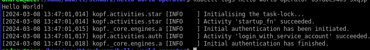

# An example of kopf operator
## Usage
To build docker image and helm chart run
```./build.sh hello-world-operator 1.0.9```
Perhaps you get error pushing image to motokotoboom dockerhub registry. If you get no errors, let me know, otherwise you can change it to yours in build.sh and hello-world-operator/helm/values.yaml
Now you should get hello-world-operator-1.0.9.tgz helm chart.
To install it to kubernetes cluster run
```helm install -n yourtestnamespace --create-namespace hello-world-operator hello-world-operator-1.0.9.tgz```

